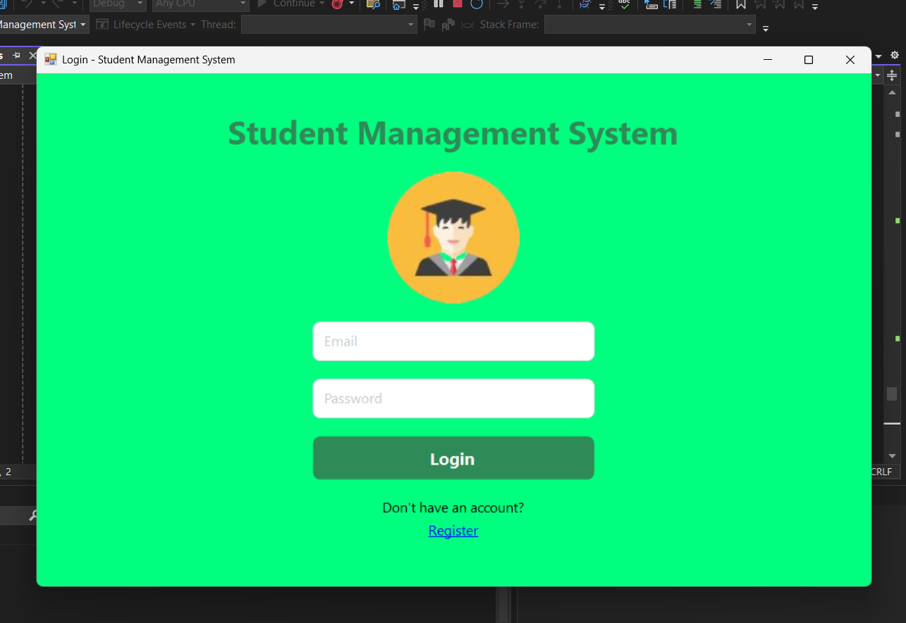
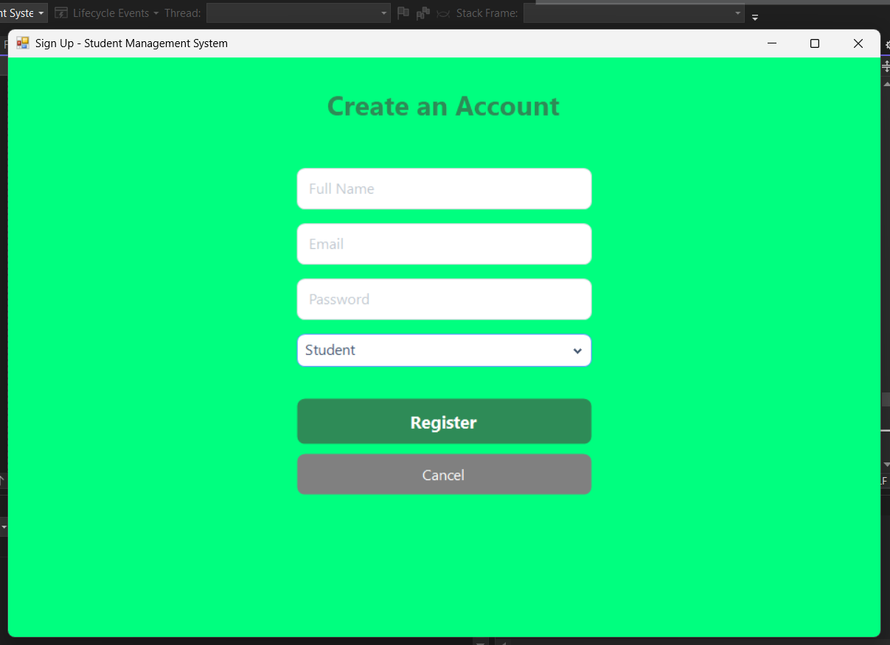

# Student-Management-Frontend (.NET)

A C# .NET front-end application for managing students, instructors, and classes. This project connects to a RESTful API (such as Django or .NET backend) and enables user authentication and CRUD operations for class management, built for educational and administrative environments.

## Features

- **User Registration & Authentication**
  - Signup form for new users (students or instructors)
  - Secure password handling with backend hashing
  - Login functionality with role-based access
  - Logout support for session management

      

- **Class Management**
  - Add new classes with details (name, code, description, instructor, year level, schedule)
  - View a list of all classes
  - Edit/update class information
  - Delete classes
  - All CRUD operations are available via RESTful API endpoints

     

- **Role Support**
  - Supports `Student` and `Instructor` roles
  - Role-based UI and access control

- **API Integration**
  - Connects to a RESTful backend for all data operations
  - Handles JWT or cookie-based authentication as provided by backend

- **Cross-Origin Resource Sharing (CORS)**
  - Configured to consume APIs from various origins (for development/testing)

- **Tech Stack**
  - C# (.NET), ASP.NET Core (MVC, Razor Pages, or Blazor)
  - Consumes REST API (Django, Node.js, .NET, etc.)
  - Modern front-end features for responsive interaction

## Consumed Endpoints (Example)

| Method | Endpoint                       | Description                    |
|--------|------------------------------- |--------------------------------|
| POST   | `/api/signup/`                 | Register a new user            |
| POST   | `/api/login/`                  | Login for existing users       |
| POST   | `/api/add_class/`              | Add a new class                |
| GET    | `/api/classes/`                | Retrieve all classes           |
| POST   | `/api/classes/edit/<id>/`      | Edit class details             |
| DELETE | `/api/classes/<id>/delete/`    | Delete a class                 |
| POST   | `/api/logout/`                 | Logout user                    |

**UI technologies:**   
**API backend (example):**  or any RESTful backend
