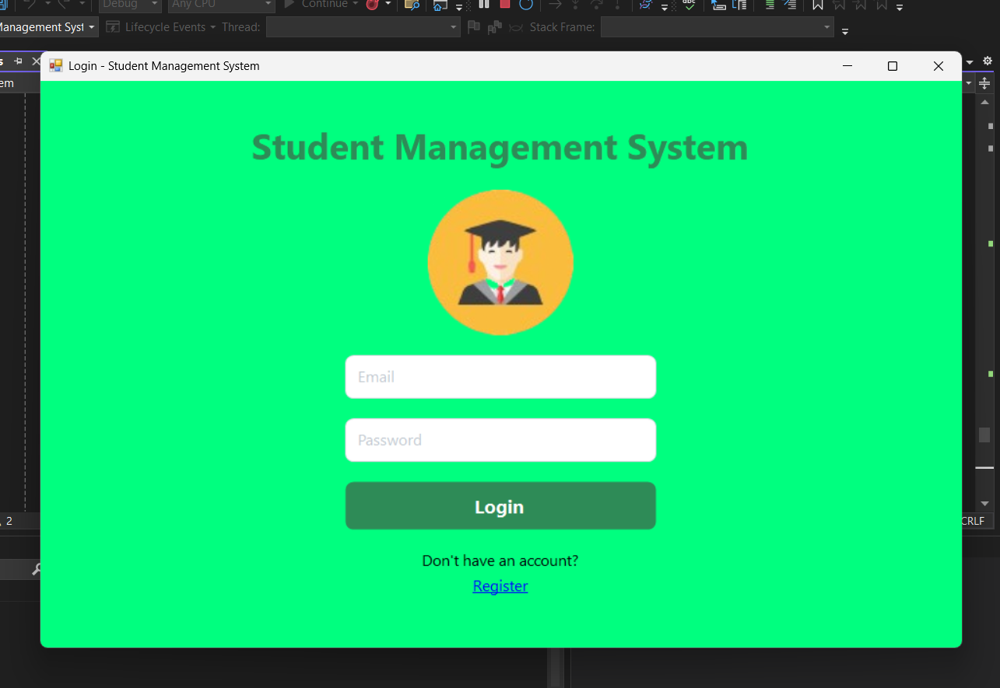
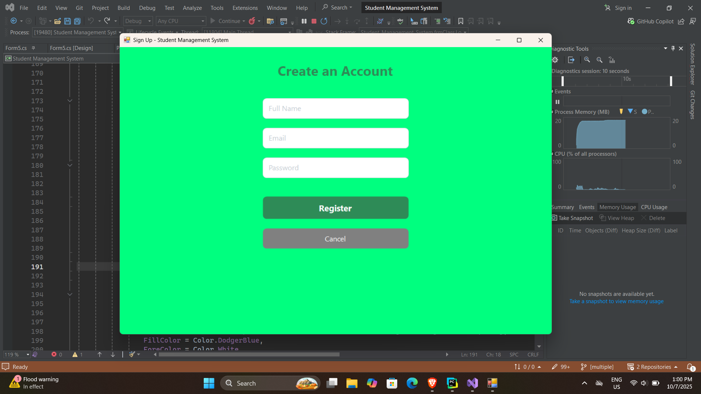
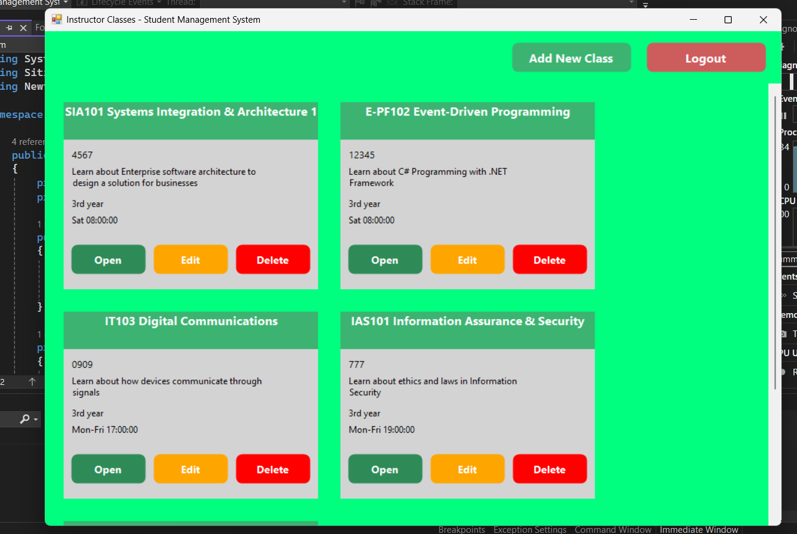

# Student Management System GUI

A comprehensive C# .NET WinForms application for managing students, instructors, classes, and assignments. This desktop application provides a modern, user-friendly interface and seamless integration with a RESTful API backend using Python Django.


## Features

### 🔐 Authentication & Authorization
- User registration with role selection (Student/Instructor)
- Secure login system with session management
- JWT or cookie-based authentication support
- Role-based UI and access control

### 👨‍🏫 Features
- **Class Management Dashboard**
  - View all assigned classes
  - Create, edit, and delete classes
  - Monitor class statistics (student count, assignments, schedules)
  
- **Assignment Management**
  - Create assignments with titles, instructions, and due dates
  - Edit existing assignments
  - Delete assignments with confirmation
  - View all assignments by class
  - Real-time assignment tracking

- **Student Management**
  - Add new students to classes
  - Edit student information (name, department, year level)
  - Remove students from classes
  - View comprehensive student lists with DataGridView
  - Track student demographics and academic details

- **Classroom Dashboard**
  - Overview cards showing:
    - Number of students enrolled
    - Total assignments for the class
    - Total classes managed
    - Class schedule (days and time)
  - Quick navigation between different views
  - Responsive layout with modern design

### 🎨 User Interface
- Modern, clean design using Siticone UI components
- Responsive layouts with dynamic sizing
- Color-coded elements for better UX:
  - MediumSeaGreen for primary actions
  - IndianRed for delete/warning actions
  - DodgerBlue for refresh actions
  - Goldenrod for edit actions
- Smooth navigation with sidebar menu
- Card-based information display
- Shadow effects and rounded corners for modern aesthetics

## Tech Stack

**Frontend:**
- C# .NET Framework/Core
- Windows Forms (WinForms)
- Siticone UI Controls
- Newtonsoft.Json for JSON serialization

**Backend Integration:**
- RESTful API communication via HttpClient
- Asynchronous operations for better performance
- CORS support for cross-origin requests

**Recommended Backend:**
- Django REST Framework
- .NET Core Web API
- Node.js/Express

## API Endpoints

### Authentication
| Method | Endpoint | Description |
|--------|----------|-------------|
| POST | `/api/signup/` | Register a new user |
| POST | `/api/login/` | User authentication |
| POST | `/api/logout/` | User logout |
| DELETE | `/api/delete_account/` | Delete user account |

### Classes
| Method | Endpoint | Description |
|--------|----------|-------------|
| GET | `/api/classes/` | Retrieve all classes |
| POST | `/api/add_class/` | Create a new class |
| POST | `/api/classes/edit/<id>/` | Edit class details |
| DELETE | `/api/classes/<id>/delete/` | Delete a class |
| GET | `/api/dashboard/` | Get dashboard statistics |

### Students
| Method | Endpoint | Description |
|--------|----------|-------------|
| GET | `/api/students/?class_id={id}` | Get students by class |
| POST | `/api/add_student/` | Add a new student |
| POST | `/api/edit_student/{id}/` | Update student information |
| POST | `/api/delete_student/{id}/` | Delete a student |

### Assignments
| Method | Endpoint | Description |
|--------|----------|-------------|
| GET | `/api/get_assignments/?class_id={id}` | Get assignments by class |
| POST | `/api/assignments/` | Create a new assignment |
| PUT | `/api/update_assignment/{id}/` | Update assignment details |
| DELETE | `/api/delete_assignment/{id}/` | Delete an assignment |

### Date Format
The application uses ISO 8601 format for date serialization:
```csharp
DateTime.Now.ToString("yyyy-MM-ddTHH:mm:ss.fffZ")
```

## Key Features Implementation

### Dynamic Dashboard
The classroom dashboard dynamically loads:
- Real-time student count
- Assignment statistics
- Class schedule information
- Responsive box layout that adapts to window size

### CRUD Operations
All CRUD operations are implemented with:
- Async/await pattern for non-blocking UI
- Error handling and user feedback
- Confirmation dialogs for destructive actions
- Automatic view refresh after operations

### Form Validation
Input validation on all forms to ensure:
- Required fields are filled
- Valid date selections
- Proper data types

## Usage

### For Users
1. Login with instructor credentials
2. View all assigned classes on the dashboard
3. Click on a class to access:
   - **Dashboard**: Overview and assignment management
   - **Student List**: Add, edit, or remove students
   - **Settings**: Account management options
4. Create assignments with deadlines
5. Manage student enrollments

## Screenshots

<div align="center">
  
  
</div>
Instructor Dashboard
<div align="center">
  
</div>

<div align="center">
  
</div>

<div align="center">
  
  
</div>
